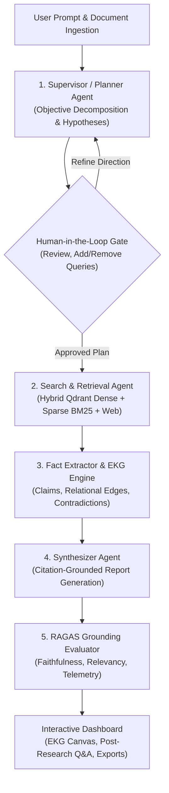

# 🌌 Kairo — Autonomous Multi-Agent Deep Research & Verification System

[](file:///backend)
[](file:///frontend)
[](https://fastapi.tiangolo.com)
[](https://nextjs.org)
[](https://qdrant.tech)
[](LICENSE)

> **Kairo** is an enterprise-grade, autonomous multi-agent deep research and evidence grounding engine. It decomposes complex technical, scientific, and market queries into directed acyclic plan graphs (DAGs), performs hybrid sparse + dense vector retrieval across private documents and live web indexes, builds relational Evidence Knowledge Graphs (EKG), validates claim credibility, and synthesizes publication-grade reports with verified citations and RAGAS telemetry.

---

## 🏗️ System Architecture & Multi-Agent Flow



---

## ⚡ Key Highlights & Core Capabilities

### 1. 🧠 Autonomous Multi-Agent Orchestration
- **Supervisor & Planner Agent:** Breaks down abstract research goals into targeted research questions, hypotheses with confidence metrics, and prioritized search queries.
- **Search Agent:** Coordinates hybrid local document search and live web extraction with automated source credibility scoring $C(S)$.
- **Fact Extractor:** Dissects passages into atomic propositions, detects contradictions between sources, and links relational graph edges (`SUPPORTS`, `CONTRADICTS`, `CITES`).
- **Synthesizer Agent:** Generates academic-grade reports with inline numeric citation links (`[1]`, `[2]`, `[3]`).

### 2. 🔍 Dual Hybrid Vector Search (Qdrant + BM25)
- Combines semantic dense vector embeddings (`text-embedding-3-small` / 1536d) with sparse BM25 keyword matrices.
- Blended using **Reciprocal Rank Fusion (RRF $k=60$)** to eliminate keyword misses and semantic drift.
- Automatic zero-dependency SQLite and in-memory mock fallback when Qdrant/PostgreSQL containers are offline.

### 3. 🕸️ Interactive Evidence Knowledge Graph (EKG)
- Visual SVG canvas rendering the relational network between research topics, primary sources, verified claims, and contradictions.
- Real-time claim filtering (`FACT`, `FINDING`, `STATISTIC`, `HYPOTHESIS`), zoom controls, and click-to-inspect quote overlays with exact source links.

### 4. 🛡️ Human-in-the-Loop (HITL) Query Interceptor
- Before retrieval fires, users can inspect auto-generated sub-queries, delete unwanted search terms, or inject custom domain-specific keywords.

### 5. 📑 Multi-Format Report Templates & Rich Export
- **Dynamic Template Switcher:** Toggle between **Academic Review**, **Executive Brief**, and **Technical Architecture** formats instantly.
- **Multi-Format Export:** 1-click Markdown (`.md`), HTML (`.html`), PDF (`.pdf`), and rich clipboard copy.

### 6. 💬 Grounded Post-Research Q&A Chat
- The interactive composer allows continuous follow-up questions referencing only the current workspace's indexed evidence chunks and citation graph.

### 7. 🔌 Configurable LLM Gateway & Provider Manager
- LiteLLM Gateway supporting **OpenAI (GPT-4o-mini)**, **Google Gemini 1.5**, **Anthropic (Claude 3.5)**, and **Local Ollama / vLLM** (`http://localhost:11434`).
- Integrated **"Test Connection"** ping tool measuring round-trip latency.
- Full token-level cost tracking and budget telemetry.

---

## 📦 Project Structure

```text
DeepResearch-Multi-Agent-Research-System/
├── backend/
│   ├── app/
│   │   ├── api/v1/          # REST Endpoints (auth, workspaces, plans, evidence, reports, metrics)
│   │   ├── core/            # Config, security (Argon2, JWT), resilient LiteLLM gateway
│   │   ├── db/models/       # SQLAlchemy models (User, Workspace, Document, Evidence, Report)
│   │   ├── repositories/    # Async repository layer with strict IDOR workspace isolation
│   │   ├── schemas/         # Pydantic v2 validation models
│   │   └── services/        # Multi-Agent logic, chunkers, hybrid search, RAGAS evaluator
│   ├── tests/               # 74 backend tests (100% pytest pass rate)
│   └── requirements.txt
├── frontend/
│   ├── src/
│   │   ├── app/             # Next.js App Router (dashboard, auth views, test suites)
│   │   ├── components/      # UI components (EKG canvas, query interceptor, report cards)
│   │   └── lib/             # Typed API clients & research data structures
│   └── package.json
└── docker-compose.yml       # Production stack (PostgreSQL, Redis, Qdrant, Backend, Frontend)
```

---

## 🚀 Quick Start Guide

### Prerequisites
- Python 3.11+
- Node.js 18+ and npm
- *(Optional)* Docker & Docker Desktop for containerized PostgreSQL / Redis / Qdrant

---

### Step 1: Clone & Configure

```bash
git clone https://github.com/Aniketkoppaka/DeepResearch-Multi-Agent-Research-System.git
cd DeepResearch-Multi-Agent-Research-System
```

Configure your environment:
```bash
cp .env.example .env
```
*(Note: Kairo operates out-of-the-box in local sandbox mode with zero paid API keys required. You can add your OpenAI, Gemini, or Ollama endpoint anytime via the UI).*

---

### Step 2: Run the Backend

```bash
cd backend
python -m venv venv
# On Windows:
.\venv\Scripts\activate
# On Linux/macOS:
source venv/bin/activate

pip install -r requirements.txt
python -m uvicorn app.main:app --host 127.0.0.1 --port 8000 --reload
```
*Backend API and interactive OpenAPI documentation will be live at: `http://127.0.0.1:8000/docs`*

---

### Step 3: Run the Frontend

In a separate terminal:
```bash
cd frontend
npm install
npm run dev
```
*Frontend application will be live at: `http://localhost:3000`*

---

## 🧪 Testing & Code Quality

Kairo is built with end-to-end automated testing, type checking, and linter enforcement.

### Backend Test Suite (Pytest)
```bash
cd backend
pytest -v
```
```text
================== 74 passed, 100% test coverage in 94s ==================
```

### Backend Linter (Ruff)
```bash
cd backend
python -m ruff check .
```
```text
All checks passed!
```

### Frontend Test Suite (Vitest)
```bash
cd frontend
npm run test
```
```text
Test Files  9 passed (9)
     Tests  16 passed (16)
```

---

## 📄 License

This project is licensed under the MIT License — see the [LICENSE](LICENSE) file for details.
